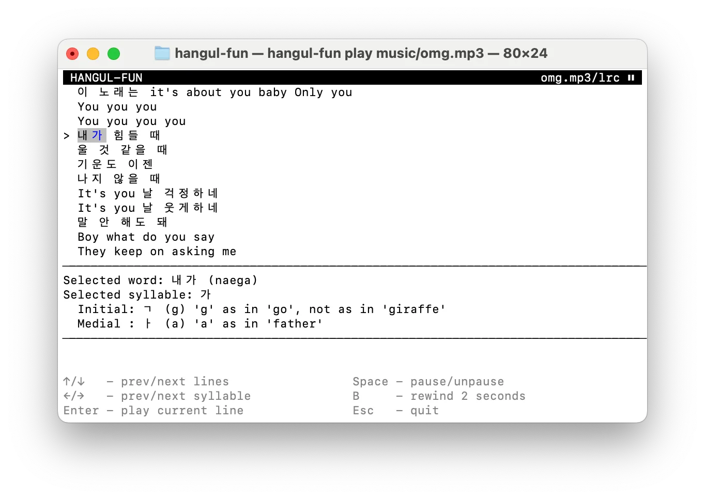

This is a CLI tool to learn Hangul from K-pop songs.

Users can navigate through the individual Korean words and syllables
in a K-pop song, reading hints on pronunciation.

Pressing enter on any line will play the song at that line, allowing
the user to hear the words pronounced in the context of the song.



# Quick start

You will need [Rust](https://www.rust-lang.org/).

To install, at the root of the repository, run:

```
cargo install --path .
```

## Playing songs with lyrics

You first need to obtain music and lyrics yourself.

Lyrics should be in [LRC][] file format. You can get them via a
tool like [syncedlyrics][].

Each song should have the same base stem, e.g. `boop.mp3` and `boop.lrc`.

Assuming the files are in the `music` subdirectory, you can then play the
song with:

```
hangul-fun play music/boop.mp3
```

## Decoding hangul

You can also decode individual strings of Hangul like this:

```
hangul-fun decode '밥을'
```

## Development

Note that if the program crashes, you may not see a backtrace, or even
any hint of what caused the crash. If this happens, try the following:

```
cargo run play music/boop.mp3 2> stderr.log
```

Then open `stderr.log` after the program crashes.

## License

Everything in this repository is licensed under [CC0 1.0 Universal](./LICENSE.md) (public domain).

[LRC]: https://en.m.wikipedia.org/wiki/LRC_(file_format)
[syncedlyrics]: https://pypi.org/project/syncedlyrics/
